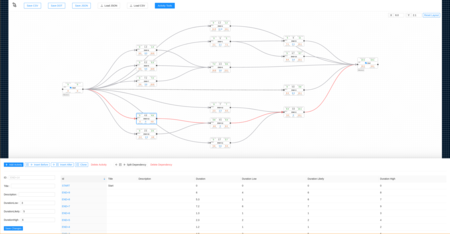

# quickplan

Faster PERT charts.

[](https://golang.org/dl/)

#### Contents

1. [Quickstart](#quickstart)
    * [Prerequisites](#prerequisites)
    * [Using Docker](#using-docker)
    * [Using Go](#using-go)
2. [What and Why?](#what-and-why)
3. [Deployment](#deployment)
4. [Limitations](#limitations)
5. [Contributing](#contributing)

---

## Quickstart

This gets you up and running as quickly as possible.

```shell
go get ./...
go generate ./...
go build ./...
cd cmd/wasm
# Builds the WASM bundle for the web app.
GOOS=js GOARCH=wasm go build -o ../../bin/main.wasm
cd ../..submodules/ProjectFlowSyntax/project-flow-syntax
npm install
cd ../../web/quickplan
npm install
cp ../../bin/main.wasm src/assets/main.wasm
cp ~/go/go1.22.3/misc/wasm/wasm_exec.js src/assets/wasm_exec.js
# Runs the dev server to do DSL-based planning in your browser.
npm run dev
```

### Prerequisites

You need either [Docker] or [Go and NPM] installed on your machine to run the application.

### Using Docker

If you don't have Go, you can use Docker. The `build/Dockerfile` works great, and it's a pretty small image (~24MB)!

```shell
docker build -f build/Dockerfile . -t quickplan
docker run -p 3535:3535 quickplan
```

Now you can visit `http://localhost:3535` in your web browser!

### Using Go

This command will use NPM to build the newest UI, then build the Go binary (with UI embedded).
From project root:

```shell
./scripts/run-local.sh
```

The server is running in the background - visit `http://localhost:3535` in your web browser!

## What and Why?

[](./docs/img/screenshot.png)

This application helps you graphically, iteratively plan a project and visualize it on a PERT chart.
I find PERT charts easier to understand than Gantt charts, and dependencies are clearly visible.

But **why** make this at all?

I needed to plan a big project at work. I couldn't find any tools that would chart dependencies without requiring a pre-made spreadsheet. So I made this.

## Deployment

The `deployment/` directory has empty Kubernetes files - so that's a TODO.

Something like `fly.io` would host the backend fine, and the UI could go on GitHub Pages.

## Limitations

Tons of limitations!

The most obvious limitation is that there isn't a persistent storage backend. Everything is in memory.
To get around that, **export the JSON** before you quit the application.

If you forget, as a last-ditch recovery, you can check `/tmp/` for files like `quickplan.<id>.tmp.graph`.
These are the JSON exports for the most recent version of your PERT chart.

## Contributing

The project needs work - please feel free to submit your PR!

### Getting Grammar

This project (will) rely on a tree-sitter grammar and generated bindings.
To get the grammar and generate bindings, do this:

```shell
# Pull in ProjectFlowSyntax to the submodules directory.
git submodule update --init --recursive
# Run the `generate_bindings.sh` script via `//go:generate`.
go generate ./...
```
