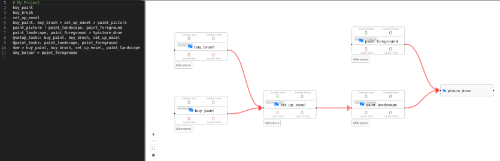

# quickplan

Faster PERT charts.

#### Contents

1. [Quickstart](#quickstart)
    * [Prerequisites](#prerequisites)
    * [Using Docker](#using-docker)
    * [Using Go](#using-go)
2. [What and Why?](#what-and-why)
3. [Deployment](#deployment)
4. [Limitations](#limitations)
5. [Contributing](#contributing)

---

## Quickstart

This gets you up and running as quickly as possible.

### Prerequisites

You need Node/NPM installed on your machine to run the application.

### Build and Run

```shell
npm install
# Generate the language files.
cd packages/project-flow-syntax
npm run langium:generate
npm run build
npm run build:web
cd ../..
# Run the web app.
npm run dev
```

You should be able to visit `http://localhost:5173` in your browser.

## What and Why?

[](./docs/img/screenshot.png)

This application helps you graphically, iteratively plan a project and visualize it on a PERT chart.
I find PERT charts easier to understand than Gantt charts, and dependencies are clearly visible.

But **why** make this at all?

I needed to plan a big project at work. I couldn't find any tools that would chart dependencies without requiring a pre-made spreadsheet. So I made this.

## Limitations

Tons of limitations!

The most obvious limitation is that there isn't a persistent storage backend. Everything is in memory.

## Contributing

The project needs work - please feel free to submit your PR!
